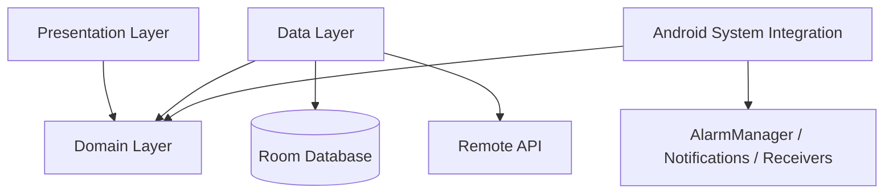

# TimeKar | تایمکار

**AI-assisted task management for Android**, built with Kotlin and Jetpack Compose.

TimeKar helps users organize tasks through timeline, list, and calendar views. It supports English and Persian (including RTL layout), voice input, AI-assisted task creation, and scheduled reminders.


## Contents

- [Features](#features)
- [Technology Stack](#technology-stack)
- [Architecture](#architecture)
- [Project Structure](#project-structure)
- [Getting Started](#getting-started)
- [Permissions](#permissions)
- [Implementation Notes](#implementation-notes)
- [Testing](#testing)
- [Build Variants](#build-variants)
- [Known Limitations](#known-limitations)
- [Contributing](#contributing)
- [License](#license)

## Features

### Task Management

- Create, edit, and delete tasks
- Schedule all-day or time-specific tasks
- Set task priorities and categories
- Break tasks into subtasks
- Configure recurring schedules
- Track task completion

### Views and Localization

- **Timeline:** View tasks by time of day
- **Tasks:** Browse and filter task lists
- **Calendar:** Navigate tasks by date
- **Settings:** Manage user preferences
- English and Persian language support
- Right-to-left (RTL) layout for Persian

### Voice Input and AI

- Convert speech to text using Android speech recognition
- Use an AI-compatible chat-completion API to assist with task creation
- Enter and edit tasks manually

### Reminders

- Schedule task reminders with `AlarmManager`
- Display task notifications
- Reschedule reminders after device reboot
- Configure reminder timing

## Technology Stack

| Area | Technologies |
|---|---|
| Language | Kotlin |
| UI | Jetpack Compose, Material 3 |
| Architecture | Clean Architecture, MVVM, Repository and Use Case patterns |
| Local storage | Room |
| Networking | Retrofit, OkHttp, Moshi |
| Asynchronous work and state | Kotlin Coroutines, Flow, StateFlow |
| Navigation | Navigation Compose |
| Dependency injection | Custom `AppContainer` / manual dependency injection |
| Android integrations | `SpeechRecognizer`, `AlarmManager`, notifications, broadcast receivers |
| Code generation | KSP, where configured by the project |

Library versions are managed by the project’s Gradle configuration and version catalog. Check `gradle/libs.versions.toml` and the Gradle build files for the exact versions used by the current checkout.

## Architecture

The project separates UI, business rules, data access, and Android system integrations. The domain layer contains the core models and contracts; data and system implementations depend on those contracts rather than making the domain depend on Android or remote APIs.



### Main Patterns

- **Repository:** Separates data sources from the rest of the app.
- **Use Case:** Keeps individual business operations focused.
- **StateFlow / Flow:** Exposes observable state to the UI.
- **Dependency inversion:** Uses contracts at architectural boundaries.
- **Single Activity:** Hosts the Compose-based application UI.

## Project Structure

The main application source is under `app/src/main/java/ir/arminniromandi/timekar/`.

```text
.
├── app/
│   ├── src/
│   │   ├── main/
│   │   │   ├── java/ir/arminniromandi/timekar/
│   │   │   │   ├── data/
│   │   │   │   │   ├── local/        # Room database, DAOs, entities
│   │   │   │   │   ├── remote/       # API services and network models
│   │   │   │   ├── repository/      # Repository implementations
│   │   │   │   └── voice/           # Speech recognition integration
│   │   │   │   ├── domain/
│   │   │   │   │   ├── model/        # TaskItem, Priority, Category
│   │   │   │   │   ├── repository/   # Repository contracts
│   │   │   │   │   ├── usecase/      # Business use cases
│   │   │   │   │   └── alarm/        # Reminder contracts
│   │   │   │   ├── ui/              # Compose screens and components
│   │   │   │   ├── system/          # Android platform integrations
│   │   │   │   ├── di/              # Dependency container
│   │   │   │   └── util/            # Shared utilities
│   │   │   ├── res/
│   │   │   └── AndroidManifest.xml
│   │   └── test/
│   ├── build.gradle.kts
│   └── proguard-rules.pro
├── gradle/
│   ├── libs.versions.toml
│   └── wrapper/
├── build.gradle.kts
├── settings.gradle.kts
├── gradle.properties
└── local.properties            # Local machine configuration; do not commit secrets
```

This is a high-level map of the packages. For the exact current structure, use the files present in the repository; package names may evolve as the project changes.

## Getting Started

### Prerequisites

- Android Studio compatible with the project’s Android Gradle Plugin
- JDK 17 or the version required by the project’s Gradle configuration
- Android SDK platforms and build tools configured for the project
- A physical Android device or emulator

Use the Gradle Wrapper included in the repository instead of installing a separate Gradle version.

### Clone the Repository

Replace the example URL and directory below with the repository’s actual GitHub URL and folder name:

```bash
git clone https://github.com/OWNER/REPOSITORY.git
cd REPOSITORY
```

### Configure the AI API Key

If the project’s Gradle configuration reads `API_KEY` from the root `local.properties`, add your key there alongside the SDK path:

```properties
sdk.dir=/path/to/your/Android/Sdk
API_KEY=your_openai_compatible_api_key
```

Use the property name expected by the current build configuration. Do not commit `local.properties`, API keys, or other credentials to version control. An API key embedded in a distributed Android app can be extracted; use a backend to protect production credentials when appropriate.

### Build and Run

Open the project in Android Studio, sync Gradle, select a device or emulator, and run the `app` configuration.

From macOS or Linux:

```bash
./gradlew assembleDebug
./gradlew installDebug
```

From Windows Command Prompt or PowerShell:

```bat
gradlew.bat assembleDebug
gradlew.bat installDebug
```

To build a release variant:

```bash
./gradlew assembleRelease
```

On Windows, use `gradlew.bat assembleRelease`.

## Permissions

| Permission or access | Purpose | Notes |
|---|---|---|
| `RECORD_AUDIO` | Voice input | Request at runtime when the user invokes the voice feature. |
| `POST_NOTIFICATIONS` | Task notifications | Runtime permission on Android 13 (API 33) and later. |
| `SCHEDULE_EXACT_ALARM` | Precise task reminders | On supported Android versions, this is special app access. Check `AlarmManager.canScheduleExactAlarms()` before scheduling. |
| `RECEIVE_BOOT_COMPLETED` | Restore reminders after reboot | Declare in the manifest; it is not a runtime permission. |

Exact-alarm access can be denied by default for some new installations on Android 14 and later. The app should handle denial and explain the limitation to users. See the [Android exact-alarm documentation](https://developer.android.com/develop/background-work/services/alarms#declare-the-appropriate-exact-alarm-permission) for platform details.

## Implementation Notes

- **Manual dependency injection:** `AppContainer` and `DefaultAppContainer` explicitly provide app dependencies.
- **Local persistence:** Room stores task data. If database seeding is enabled in the current implementation, sample tasks are inserted when the database is first created.
- **Voice recognition:** `VoiceToTextManager` wraps Android’s `SpeechRecognizer` and exposes recognition state to the UI.
- **Reminder scheduling:** `AndroidTaskReminderScheduler` uses `AlarmManager`; `BootCompletedReceiver` handles reminder rescheduling after device restart.
- **Bilingual UI:** `AppStrings` provides language-dependent strings for English and Persian.

## Testing

Run unit tests:

```bash
./gradlew test
```

Run instrumented tests on a connected device or emulator:

```bash
./gradlew connectedAndroidTest
```

On Windows, replace `./gradlew` with `gradlew.bat`. The commands run the tests that are present in the current checkout; they do not guarantee that every layer has test coverage.

## Build Variants

- **Debug:** Intended for development and debugging. Check the active build configuration for logging and optimization settings.
- **Release:** May enable R8 shrinking, obfuscation, and resource optimization according to the release build configuration.

## Known Limitations

- AI-assisted task creation requires a compatible API endpoint and valid configuration.
- Voice input depends on speech-recognition services available on the device and may require network access or language packs.
- Exact reminder delivery depends on Android alarm access and device-specific battery restrictions.

## Contributing

Contributions and bug reports are welcome.

1. Fork the repository.
2. Create a feature branch, for example `feature/task-filter`.
3. Make a focused change and add or update tests where appropriate.
4. Follow the [Kotlin coding conventions](https://kotlinlang.org/docs/coding-conventions.html).
5. Open a pull request with a clear description of the change.

## License

This project is licensed under the Apache License 2.0. See the [`LICENSE`](LICENSE) file for details.
