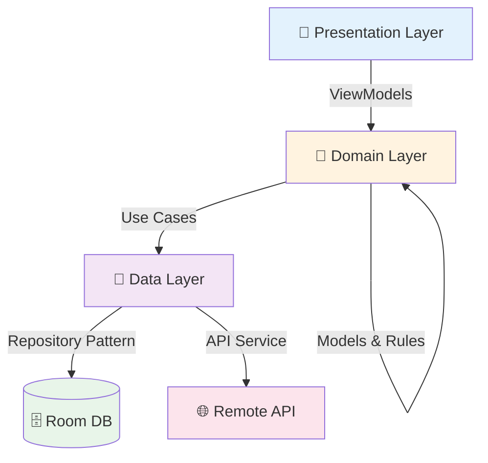

# TimeKar (تایمکار)
<div align="center">

# 📱 TimeKar | تایمکار

### AI-Powered Task Management for Android

*A modern Jetpack Compose application with voice input, bilingual support, and Clean Architecture*

[](https://kotlinlang.org)
[](https://developer.android.com/jetpack/compose)
[](https://developer.android.com)
[](LICENSE)

[Features](#-features) • [Tech Stack](#-tech-stack) • [Architecture](#-architecture) • [Getting Started](#-getting-started) • [Screenshots](#-screenshots)

</div>

---

A modern Android task management application with AI-powered voice input, built with Jetpack Compose and Clean Architecture. TimeKar helps users organize their tasks through multiple views: timeline, task list, and calendar, with support for both English and Persian languages.
## 🎯 Overview

## Overview
TimeKar is a productivity application that combines **traditional task management** with **AI-assisted creation**. Users can organize tasks through multiple views (Timeline, List, Calendar) with support for both **English** and **Persian** (RTL) languages.

TimeKar is a productivity app that combines traditional task management with AI-assisted task creation. Users can create tasks manually or use voice input to generate tasks through natural language processing. The app features a clean, material design interface with comprehensive scheduling capabilities including reminders, subtasks, priorities, and recurring events.
<div align="center">

## Features
### ✨ Create Tasks Your Way

### Task Management
- Create, edit, and delete tasks with detailed information
- Support for all-day tasks and time-specific tasks
- Task priorities (Low, Normal, High)
- Categories for organizing tasks (Work, Personal, Finance, Health, etc.)
- Subtask support with completion tracking
- Task completion status with timestamps
- Recurring task scheduling
  | 🎤 Voice Input | 🤖 AI Processing | ✍️ Manual Entry |
  |:---:|:---:|:---:|
  | Speak naturally | AI extracts details | Full control |

### Multiple Views
- **Timeline Screen**: Chronological view of scheduled tasks with hourly timeline
- **Tasks Screen**: Organized task lists with filters (All, Today, Upcoming, Overdue, Completed)
- **Calendar Screen**: Monthly calendar view with task indicators
- **Settings Screen**: User preferences and app configuration
</div>

### Voice Input & AI Integration
- Voice-to-text task creation using Android Speech Recognition
- AI-powered task parsing through chat completion API
- Real-time voice recognition state feedback
- Automatic task field extraction from natural language
---

### Reminders & Notifications
- Exact alarm scheduling for task reminders
- Configurable reminder times before task start
- Boot-completed receiver to reschedule alarms after device restart
- Persistent notification support
## 🚀 Features

### Localization
- Full bilingual support (English/Persian)
- RTL layout support for Persian
- Dynamic string resources based on language preference
<table>
<tr>
<td width="50%" valign="top">

## Tech Stack
### 📋 Task Management
- ✅ Create, edit, delete tasks
- ⏰ All-day & timed tasks
- 🎯 Three priority levels
- 🏷️ Custom categories
- 📝 Subtasks with tracking
- 🔄 Recurring schedules
- ✔️ Completion timestamps

### Core
- **Language**: Kotlin 2.2.10
- **UI Framework**: Jetpack Compose with Material3
- **Build System**: Gradle (AGP 9.0.0) with Kotlin DSL
- **Min SDK**: 24 (Android 7.0)
- **Target SDK**: 36
### 🌐 Localization
- 🇬🇧 English / 🇮🇷 Persian
- ↔️ RTL layout support
- 🔤 Dynamic string system

</td>
<td width="50%" valign="top">

### 🎨 Multiple Views
- 📊 **Timeline**: Hourly schedule
- 📝 **Tasks**: Filtered lists
- 📅 **Calendar**: Monthly view
- ⚙️ **Settings**: User preferences

### 🔔 Smart Reminders
- ⏱️ Exact alarm scheduling
- 🔋 Survives device reboot
- 📢 Persistent notifications
- ⚡ Configurable timing

</td>
</tr>
</table>

---

## 🛠 Tech Stack

### Core Technologies

| Category | Technology | Version |
|:---------|:-----------|:-------:|
| **Language** | Kotlin | 2.2.10 |
| **UI Framework** | Jetpack Compose + Material3 | 2024.09 |
| **Build System** | Gradle (AGP) | 9.0.0 |
| **Min SDK** | Android 7.0 | 24 |
| **Target SDK** | Android 15 | 36 |

### Architecture & Libraries
- **Architecture Pattern**: Clean Architecture with MVVM
- **Dependency Injection**: Manual DI with AppContainer pattern
- **Database**: Room 2.7.0 for local persistence
- **Networking**: Retrofit 2.12.0 + OkHttp 4.10.0
- **JSON Parsing**: Moshi 1.15.2 with Kotlin code generation
- **Coroutines**: Kotlinx Coroutines 1.10.2
- **Navigation**: Jetpack Navigation Compose 2.8.9
- **Lifecycle**: ViewModel + LiveData integration

<table>
<tr>
<td width="50%">

**🏛️ Architecture**
- Clean Architecture
- MVVM Pattern
- Manual DI Container
- Single Activity

**💾 Data Layer**
- Room Database `2.7.0`
- Retrofit `2.12.0`
- OkHttp `4.10.0`
- Moshi `1.15.2`

</td>
<td width="50%">

**🧵 Async & State**
- Kotlin Coroutines `1.10.2`
- StateFlow / Flow
- Lifecycle-aware ViewModels

**🧭 Navigation & UI**
- Navigation Compose `2.8.9`
- Material Icons Extended
- Compose BOM

</td>
</tr>
</table>

### 🔧 Code Generation

```kotlin
KSP 2.3.5  →  Room DAOs + Moshi JSON Adapters
```

---

### Code Generation
- KSP (Kotlin Symbol Processing) 2.3.5 for Room and Moshi annotation processing
## 🏗 Architecture

## Architecture
### Clean Architecture Layers

The project follows Clean Architecture principles with clear separation of concerns:


### Layer Structure
### 📂 Project Structure

<table>
<tr>
<td width="33%" valign="top">

**🎨 Presentation**
```
app/src/main/java/ir/arminniromandi/timekar/
├── data/              # Data layer
│   ├── local/         # Room database, DAOs, entities
│   ├── remote/        # Retrofit API service, network models
│   ├── repository/    # Repository implementations
│   └── voice/         # Voice recognition manager
├── domain/            # Domain layer
│   ├── model/         # Domain models (TaskItem, Priority, Category)
│   ├── repository/    # Repository interfaces
│   ├── usecase/       # Use cases for business logic
│   └── alarm/         # Reminder scheduling contracts
├── ui/                # Presentation layer
│   ├── screens/       # Screen composables (Timeline, Tasks, Calendar, Settings)
│   ├── components/    # Reusable UI components
│   ├── theme/         # Material3 theming
│   ├── voice/         # Voice UI logic
│   └── shared/        # Shared ViewModels
├── system/            # Android system integration
│   ├── alarm/         # AlarmManager integration
│   ├── notification/  # Notification handling
│   └── receiver/      # Broadcast receivers
├── di/                # Dependency injection container
└── util/              # Utility classes (DateHelper)
ui/
├── screens/
│   ├── timeline/
│   ├── tasks/
│   ├── calendar/
│   └── settings/
├── components/
├── theme/
└── voice/
```

### Key Design Patterns
- **Repository Pattern**: Abstraction over data sources
- **Use Case Pattern**: Single responsibility business logic units
- **Observer Pattern**: StateFlow/Flow for reactive data streams
- **Dependency Inversion**: Interfaces for all major components
- **Single Activity Architecture**: Compose navigation without fragments
</td>
<td width="33%" valign="top">

**💼 Domain**
```
domain/
├── model/
│   ├── TaskItem
│   ├── Priority
│   └── Category
├── repository/
├── usecase/
└── alarm/
```

## Project Structure
</td>
<td width="33%" valign="top">

**💾 Data**
```
chronos/
├── app/
│   ├── src/
│   │   ├── main/
│   │   │   ├── java/ir/arminniromandi/timekar/
│   │   │   ├── res/
│   │   │   └── AndroidManifest.xml
│   │   └── test/
│   ├── build.gradle.kts
│   └── proguard-rules.pro
├── gradle/
│   ├── libs.versions.toml      # Version catalog
│   └── wrapper/
├── build.gradle.kts            # Root build file
├── settings.gradle.kts
├── gradle.properties
└── local.properties            # API keys (not in VCS)
data/
├── local/
│   ├── dao/
│   └── entity/
├── remote/
│   ├── api/
│   └── model/
├── repository/
└── voice/
```

## Getting Started
</td>
</tr>
</table>

### 🎯 Key Design Patterns

| Pattern | Implementation | Benefit |
|:--------|:---------------|:--------|
| **Repository** | Data abstraction | Single source of truth |
| **Use Case** | Business logic units | Testable & reusable |
| **Observer** | StateFlow/Flow | Reactive UI updates |
| **Dependency Inversion** | Interface contracts | Loose coupling |

---

## 🚦 Getting Started

### Prerequisites
- Android Studio Ladybug | 2024.2.1 or newer
- JDK 11 or higher
- Android SDK 36
- Gradle 8.x (bundled with wrapper)

### Clone the Repository
| Requirement | Version |
|:------------|:-------:|
| Android Studio | Ladybug 2024.2.1+ |
| JDK | 11+ |
| Android SDK | 36 |
| Gradle | 8.x |

### 📥 Installation

```bash
# Clone repository
git clone https://github.com/yourusername/chronos.git
cd chronos

# Create local.properties
echo "sdk.dir=/path/to/Android/Sdk" > local.properties
echo "API_KEY=your_api_key_here" >> local.properties

# Build and install
./gradlew assembleDebug
./gradlew installDebug
```

### Configuration
### ⚙️ Configuration

1. Create a `local.properties` file in the root directory:
#### 1. API Key Setup

Create `local.properties` in project root:

```properties
sdk.dir=/path/to/your/Android/Sdk
API_KEY=your_api_key_here
API_KEY=your_openai_compatible_api_key
```

2. The `API_KEY` is used for the AI task creation feature. You'll need an API key from an OpenAI-compatible chat completion endpoint.
> 🔑 **API Key**: Required for AI task creation. Use an OpenAI-compatible chat completion endpoint.

### Build and Run
#### 2. Build & Run

1. Open the project in Android Studio
2. Sync Gradle files
3. Select a device or emulator (API 24+)
4. Run the app
<table>
<tr>
<td width="50%">

Alternatively, build from the command line:
**Via Android Studio**
1. Open project
2. Sync Gradle
3. Select device (API 24+)
4. Click Run ▶️

</td>
<td width="50%">

**Via Command Line**
```bash
# Debug build
./gradlew assembleDebug
./gradlew installDebug

# Release build
./gradlew assembleRelease
```

## Permissions
</td>
</tr>
</table>

---

## 🔐 Permissions

| Permission | Purpose | Required |
|:-----------|:--------|:--------:|
| `SCHEDULE_EXACT_ALARM` | Precise task reminders | Runtime |
| `RECEIVE_BOOT_COMPLETED` | Reschedule after reboot | Install |
| `POST_NOTIFICATIONS` | Show notifications (API 33+) | Runtime |
| `RECORD_AUDIO` | Voice input feature | Runtime |

> ℹ️ All runtime permissions are requested when the user first uses the relevant feature.

---

## 💡 Implementation Highlights

<details>
<summary><b>🎯 Manual Dependency Injection</b></summary>

```kotlin
interface AppContainer {
    val taskRepository: TaskRepository
    val reminderManager: ReminderManager
    // ... clean dependency graph
}
```
Benefits: Explicit dependencies, fast compile times, no annotation processing overhead.
</details>

The app requires the following permissions:
<details>
<summary><b>🗄️ Room Database Seeding</b></summary>

- `SCHEDULE_EXACT_ALARM` - For precise task reminders
- `RECEIVE_BOOT_COMPLETED` - To reschedule alarms after device restart
- `POST_NOTIFICATIONS` - For task reminder notifications (Android 13+)
- `RECORD_AUDIO` - For voice input feature
  Pre-populated with sample tasks on first launch:
```kotlin
.addCallback(object : Callback() {
    override fun onCreate(db: SupportSQLiteDatabase) {
        CoroutineScope(Dispatchers.IO).launch {
            taskDao().insertAll(getInitialSeedTasks())
        }
    }
})
```
</details>

All permissions are requested at runtime when needed.
<details>
<summary><b>🎤 Coroutine-Based Voice Recognition</b></summary>

## Implementation Highlights
`VoiceToTextManager` wraps `SpeechRecognizer` with:
- StateFlow for reactive state
- Pause/resume support
- Automatic silence detection
- Accumulated text handling
</details>

### Manual Dependency Injection
The app uses a custom `AppContainer` interface with `DefaultAppContainer` implementation instead of Dagger/Hilt. This provides explicit dependency graphs while keeping the codebase simple and compile-time fast.
<details>
<summary><b>⏰ Persistent Alarm System</b></summary>

### Room Database with Seeding
The database is pre-populated with sample tasks on first launch, demonstrating various task types and scheduling patterns. See `AppDatabase.getInitialSeedTasks()` for implementation.
- `AndroidTaskReminderScheduler`: Schedules exact alarms
- `BootCompletedReceiver`: Reschedules all alarms after device restart
- Survives system reboots and app updates
</details>

### Voice Recognition Flow
`VoiceToTextManager` wraps Android's `SpeechRecognizer` with coroutine-based state management, providing pause/resume functionality and automatic silence detection for better UX.
<details>
<summary><b>🌐 Compile-Time Safe Strings</b></summary>

### Alarm Persistence
`AndroidTaskReminderScheduler` integrates with AlarmManager to schedule exact alarms. `BootCompletedReceiver` ensures alarms survive device reboots by rescheduling all active reminders.
```kotlin
class AppStrings(val language: AppLanguage) {
    val appTitle: String get() = if (isPersian) "تایمکار" else "TimeKar"
}
```
No XML inflation overhead, type-safe access, dynamic language switching.
</details>

### Bilingual String Management
`AppStrings` class provides compile-time safe, dynamic string resources based on user language preference, avoiding XML resource inflation overhead.
---

## Testing
## 🧪 Testing

Run unit tests:
### Run Tests

```bash
# Unit tests
./gradlew test
```

Run instrumented tests:

```bash
# Instrumented tests
./gradlew connectedAndroidTest
```

The project includes:
- Unit tests for use cases and repositories
- Compose UI tests for screens and components
- Coroutines test support with `kotlinx-coroutines-test`
### Test Coverage

| Type | Coverage |
|:-----|:---------|
| ✅ Unit Tests | Use Cases, Repositories |
| 🎨 Compose UI Tests | Screens, Components |
| ⚡ Coroutines Tests | Async operations |

## Build Variants
---

### Debug
- No code minification
## 📦 Build Variants

<table>
<tr>
<th width="50%">🐛 Debug</th>
<th width="50%">🚀 Release</th>
</tr>
<tr>
<td valign="top">

- No minification
- Debug logging enabled
- Unoptimized for faster builds
- Faster build times
- Unoptimized resources

</td>
<td valign="top">

- R8 minification
- Resource shrinking
- ProGuard rules
- Optimized APK size

</td>
</tr>
</table>

---

## 🤝 Contributing

Contributions are welcome! Follow these steps:

1. 🍴 **Fork** the repository
2. 🌿 **Create** a feature branch
   ```bash
   git checkout -b feature/amazing-feature
   ```
3. ✅ **Write** tests for new functionality
4. 💾 **Commit** your changes
   ```bash
   git commit -m 'Add amazing feature'
   ```
5. 📤 **Push** to the branch
   ```bash
   git push origin feature/amazing-feature
   ```
6. 🎉 **Open** a Pull Request

### Code Style
- Follow [Kotlin coding conventions](https://kotlinlang.org/docs/coding-conventions.html)
- Use meaningful variable names
- Write documentation for public APIs
- Keep functions small and focused

---

## ⚠️ Known Limitations

| Issue | Description | Workaround |
|:------|:------------|:-----------|
| 🔑 API Requirement | AI features need external API key | Configure in `local.properties` |
| 🎤 Voice Service | Depends on device speech recognition | Google app recommended |
| ⏰ Alarm Restrictions | Android 12+ may limit exact alarms | User must grant permission |

---

### Release
- ProGuard/R8 minification enabled
- Resource shrinking enabled
- Optimized for smaller APK size
## 📄 License

## Contributing
This project is licensed under the Apache License 2.0 - see the [LICENSE](LICENSE) file for details.

Contributions are welcome. Please follow these guidelines:
---

1. Fork the repository
2. Create a feature branch (`git checkout -b feature/amazing-feature`)
3. Follow Kotlin coding conventions
4. Write tests for new functionality
5. Commit your changes (`git commit -m 'Add amazing feature'`)
6. Push to the branch (`git push origin feature/amazing-feature`)
7. Open a Pull Request
## 📞 Contact & Support

## Known Limitations
<div align="center">

- AI task creation requires external API key configuration
- Voice recognition depends on device-installed speech recognition services
- Exact alarms may be restricted on some devices (Android 12+)
  **Questions? Issues? Ideas?**

[](https://github.com/yourusername/chronos/issues)
[](https://github.com/yourusername/chronos/discussions)

</div>

---

**Built with Kotlin & Jetpack Compose**
<div align="center">

### 🌟 Star this repo if you find it useful!

**Built with ❤️ using Kotlin & Jetpack Compose**

*Made by developers, for developers*

</div>

