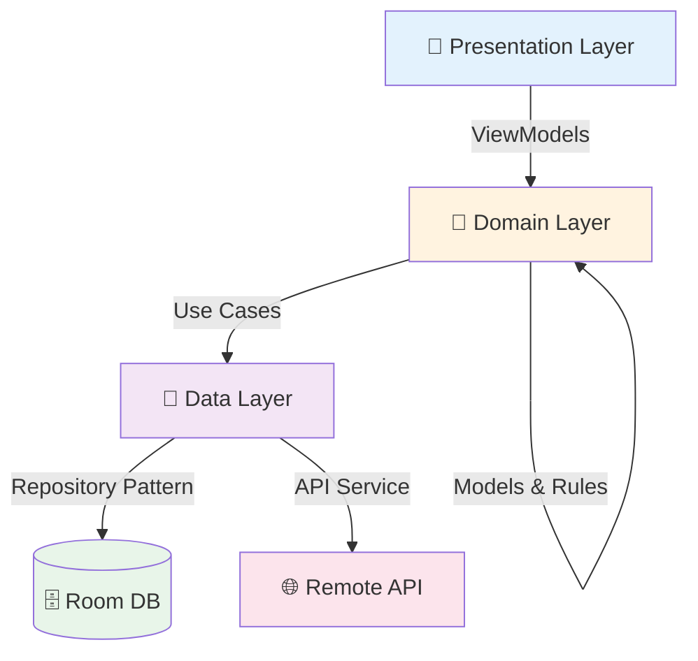

<div align="center">

# 📱 TimeKar | تایمکار

### AI-Powered Task Management for Android

*A modern Jetpack Compose application with voice input, bilingual support, and Clean Architecture*

[](https://kotlinlang.org)
[](https://developer.android.com/jetpack/compose)
[](https://developer.android.com)
[](LICENSE)

[Features](#-features) • [Tech Stack](#-tech-stack) • [Architecture](#-architecture) • [Getting Started](#-getting-started) • [Screenshots](#-screenshots)

</div>

---

## 🎯 Overview

TimeKar is a productivity application that combines **traditional task management** with **AI-assisted creation**. Users can organize tasks through multiple views (Timeline, List, Calendar) with support for both **English** and **Persian** (RTL) languages.

<div align="center">

### ✨ Create Tasks Your Way

| 🎤 Voice Input | 🤖 AI Processing | ✍️ Manual Entry |
|:---:|:---:|:---:|
| Speak naturally | AI extracts details | Full control |

</div>

---

## 🚀 Features

<table>
<tr>
<td width="50%" valign="top">

### 📋 Task Management
- ✅ Create, edit, delete tasks
- ⏰ All-day & timed tasks
- 🎯 Three priority levels
- 🏷️ Custom categories
- 📝 Subtasks with tracking
- 🔄 Recurring schedules
- ✔️ Completion timestamps

### 🌐 Localization
- 🇬🇧 English / 🇮🇷 Persian
- ↔️ RTL layout support
- 🔤 Dynamic string system

</td>
<td width="50%" valign="top">

### 🎨 Multiple Views
- 📊 **Timeline**: Hourly schedule
- 📝 **Tasks**: Filtered lists
- 📅 **Calendar**: Monthly view
- ⚙️ **Settings**: User preferences

### 🔔 Smart Reminders
- ⏱️ Exact alarm scheduling
- 🔋 Survives device reboot
- 📢 Persistent notifications
- ⚡ Configurable timing

</td>
</tr>
</table>

---

## 🛠 Tech Stack

### Core Technologies

| Category | Technology | Version |
|:---------|:-----------|:-------:|
| **Language** | Kotlin | 2.2.10 |
| **UI Framework** | Jetpack Compose + Material3 | 2024.09 |
| **Build System** | Gradle (AGP) | 9.0.0 |
| **Min SDK** | Android 7.0 | 24 |
| **Target SDK** | Android 15 | 36 |

### Architecture & Libraries

<table>
<tr>
<td width="50%">

**🏛️ Architecture**
- Clean Architecture
- MVVM Pattern
- Manual DI Container
- Single Activity

**💾 Data Layer**
- Room Database `2.7.0`
- Retrofit `2.12.0`
- OkHttp `4.10.0`
- Moshi `1.15.2`

</td>
<td width="50%">

**🧵 Async & State**
- Kotlin Coroutines `1.10.2`
- StateFlow / Flow
- Lifecycle-aware ViewModels

**🧭 Navigation & UI**
- Navigation Compose `2.8.9`
- Material Icons Extended
- Compose BOM

</td>
</tr>
</table>

### 🔧 Code Generation

```kotlin
KSP 2.3.5  →  Room DAOs + Moshi JSON Adapters
```

---

## 🏗 Architecture

### Clean Architecture Layers



### 📂 Project Structure

<table>
<tr>
<td width="33%" valign="top">

**🎨 Presentation**
```
ui/
├── screens/
│   ├── timeline/
│   ├── tasks/
│   ├── calendar/
│   └── settings/
├── components/
├── theme/
└── voice/
```

</td>
<td width="33%" valign="top">

**💼 Domain**
```
domain/
├── model/
│   ├── TaskItem
│   ├── Priority
│   └── Category
├── repository/
├── usecase/
└── alarm/
```

</td>
<td width="33%" valign="top">

**💾 Data**
```
data/
├── local/
│   ├── dao/
│   └── entity/
├── remote/
│   ├── api/
│   └── model/
├── repository/
└── voice/
```

</td>
</tr>
</table>

### 🎯 Key Design Patterns

| Pattern | Implementation | Benefit |
|:--------|:---------------|:--------|
| **Repository** | Data abstraction | Single source of truth |
| **Use Case** | Business logic units | Testable & reusable |
| **Observer** | StateFlow/Flow | Reactive UI updates |
| **Dependency Inversion** | Interface contracts | Loose coupling |

---

## 🚦 Getting Started

### Prerequisites

| Requirement | Version |
|:------------|:-------:|
| Android Studio | Ladybug 2024.2.1+ |
| JDK | 11+ |
| Android SDK | 36 |
| Gradle | 8.x |

### 📥 Installation

```bash
# Clone repository
git clone https://github.com/yourusername/chronos.git
cd chronos

# Create local.properties
echo "sdk.dir=/path/to/Android/Sdk" > local.properties
echo "API_KEY=your_api_key_here" >> local.properties

# Build and install
./gradlew assembleDebug
./gradlew installDebug
```

### ⚙️ Configuration

#### 1. API Key Setup

Create `local.properties` in project root:

```properties
sdk.dir=/path/to/your/Android/Sdk
API_KEY=your_openai_compatible_api_key
```

> 🔑 **API Key**: Required for AI task creation. Use an OpenAI-compatible chat completion endpoint.

#### 2. Build & Run

<table>
<tr>
<td width="50%">

**Via Android Studio**
1. Open project
2. Sync Gradle
3. Select device (API 24+)
4. Click Run ▶️

</td>
<td width="50%">

**Via Command Line**
```bash
# Debug build
./gradlew assembleDebug

# Release build
./gradlew assembleRelease
```

</td>
</tr>
</table>

---

## 🔐 Permissions

| Permission | Purpose | Required |
|:-----------|:--------|:--------:|
| `SCHEDULE_EXACT_ALARM` | Precise task reminders | Runtime |
| `RECEIVE_BOOT_COMPLETED` | Reschedule after reboot | Install |
| `POST_NOTIFICATIONS` | Show notifications (API 33+) | Runtime |
| `RECORD_AUDIO` | Voice input feature | Runtime |

> ℹ️ All runtime permissions are requested when the user first uses the relevant feature.

---

## 💡 Implementation Highlights

<details>
<summary><b>🎯 Manual Dependency Injection</b></summary>

```kotlin
interface AppContainer {
    val taskRepository: TaskRepository
    val reminderManager: ReminderManager
    // ... clean dependency graph
}
```
Benefits: Explicit dependencies, fast compile times, no annotation processing overhead.
</details>

<details>
<summary><b>🗄️ Room Database Seeding</b></summary>

Pre-populated with sample tasks on first launch:
```kotlin
.addCallback(object : Callback() {
    override fun onCreate(db: SupportSQLiteDatabase) {
        CoroutineScope(Dispatchers.IO).launch {
            taskDao().insertAll(getInitialSeedTasks())
        }
    }
})
```
</details>

<details>
<summary><b>🎤 Coroutine-Based Voice Recognition</b></summary>

`VoiceToTextManager` wraps `SpeechRecognizer` with:
- StateFlow for reactive state
- Pause/resume support
- Automatic silence detection
- Accumulated text handling
</details>

<details>
<summary><b>⏰ Persistent Alarm System</b></summary>

- `AndroidTaskReminderScheduler`: Schedules exact alarms
- `BootCompletedReceiver`: Reschedules all alarms after device restart
- Survives system reboots and app updates
</details>

<details>
<summary><b>🌐 Compile-Time Safe Strings</b></summary>

```kotlin
class AppStrings(val language: AppLanguage) {
    val appTitle: String get() = if (isPersian) "تایمکار" else "TimeKar"
}
```
No XML inflation overhead, type-safe access, dynamic language switching.
</details>

---

## 🧪 Testing

### Run Tests

```bash
# Unit tests
./gradlew test

# Instrumented tests
./gradlew connectedAndroidTest
```

### Test Coverage

| Type | Coverage |
|:-----|:---------|
| ✅ Unit Tests | Use Cases, Repositories |
| 🎨 Compose UI Tests | Screens, Components |
| ⚡ Coroutines Tests | Async operations |

---

## 📦 Build Variants

<table>
<tr>
<th width="50%">🐛 Debug</th>
<th width="50%">🚀 Release</th>
</tr>
<tr>
<td valign="top">

- No minification
- Debug logging enabled
- Faster build times
- Unoptimized resources

</td>
<td valign="top">

- R8 minification
- Resource shrinking
- ProGuard rules
- Optimized APK size

</td>
</tr>
</table>

---

## 🤝 Contributing

Contributions are welcome! Follow these steps:

1. 🍴 **Fork** the repository
2. 🌿 **Create** a feature branch
   ```bash
   git checkout -b feature/amazing-feature
   ```
3. ✅ **Write** tests for new functionality
4. 💾 **Commit** your changes
   ```bash
   git commit -m 'Add amazing feature'
   ```
5. 📤 **Push** to the branch
   ```bash
   git push origin feature/amazing-feature
   ```
6. 🎉 **Open** a Pull Request

### Code Style
- Follow [Kotlin coding conventions](https://kotlinlang.org/docs/coding-conventions.html)
- Use meaningful variable names
- Write documentation for public APIs
- Keep functions small and focused

---

## ⚠️ Known Limitations

| Issue | Description | Workaround |
|:------|:------------|:-----------|
| 🔑 API Requirement | AI features need external API key | Configure in `local.properties` |
| 🎤 Voice Service | Depends on device speech recognition | Google app recommended |
| ⏰ Alarm Restrictions | Android 12+ may limit exact alarms | User must grant permission |

---

## 📄 License

This project is licensed under the Apache License 2.0 - see the [LICENSE](LICENSE) file for details.

---

## 📞 Contact & Support

<div align="center">

**Questions? Issues? Ideas?**

[](https://github.com/yourusername/chronos/issues)
[](https://github.com/yourusername/chronos/discussions)

</div>

---

<div align="center">

### 🌟 Star this repo if you find it useful!

**Built with ❤️ using Kotlin & Jetpack Compose**

*Made by developers, for developers*

</div>
